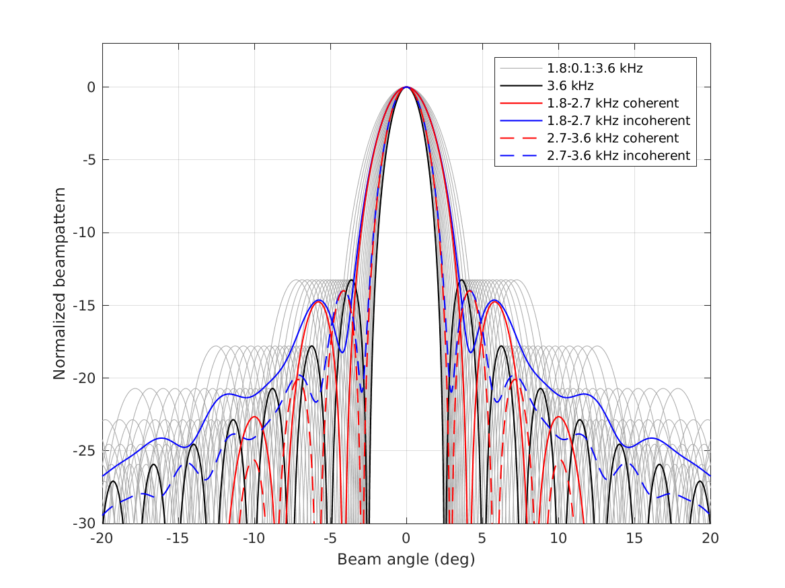
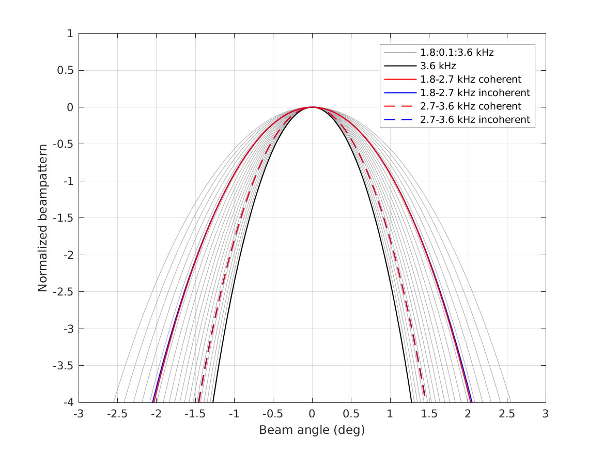
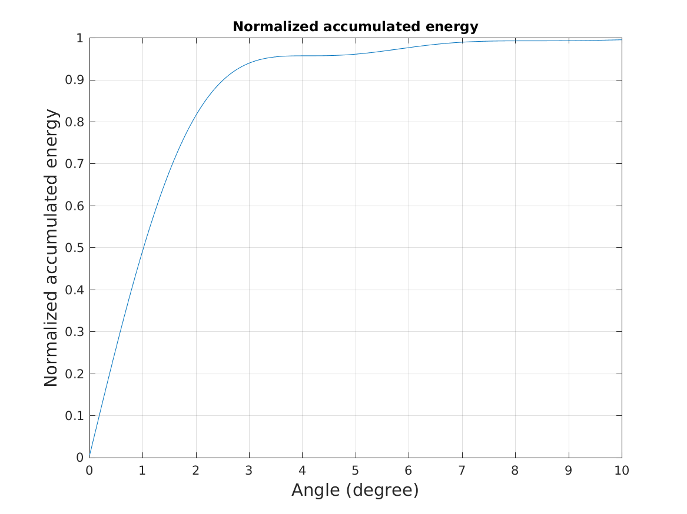
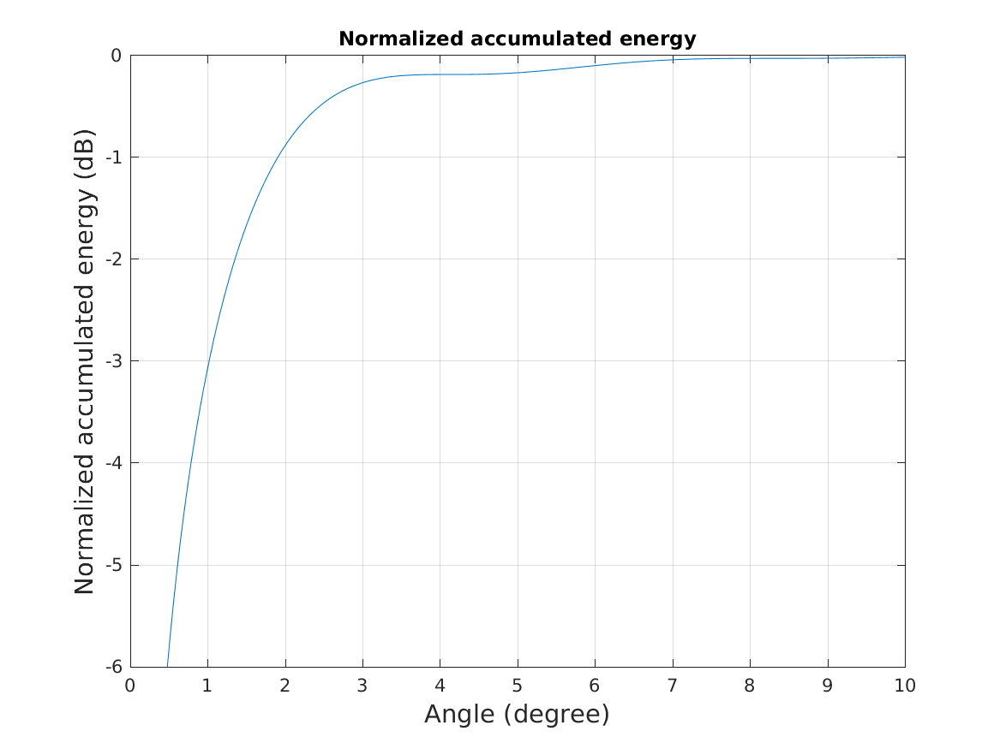
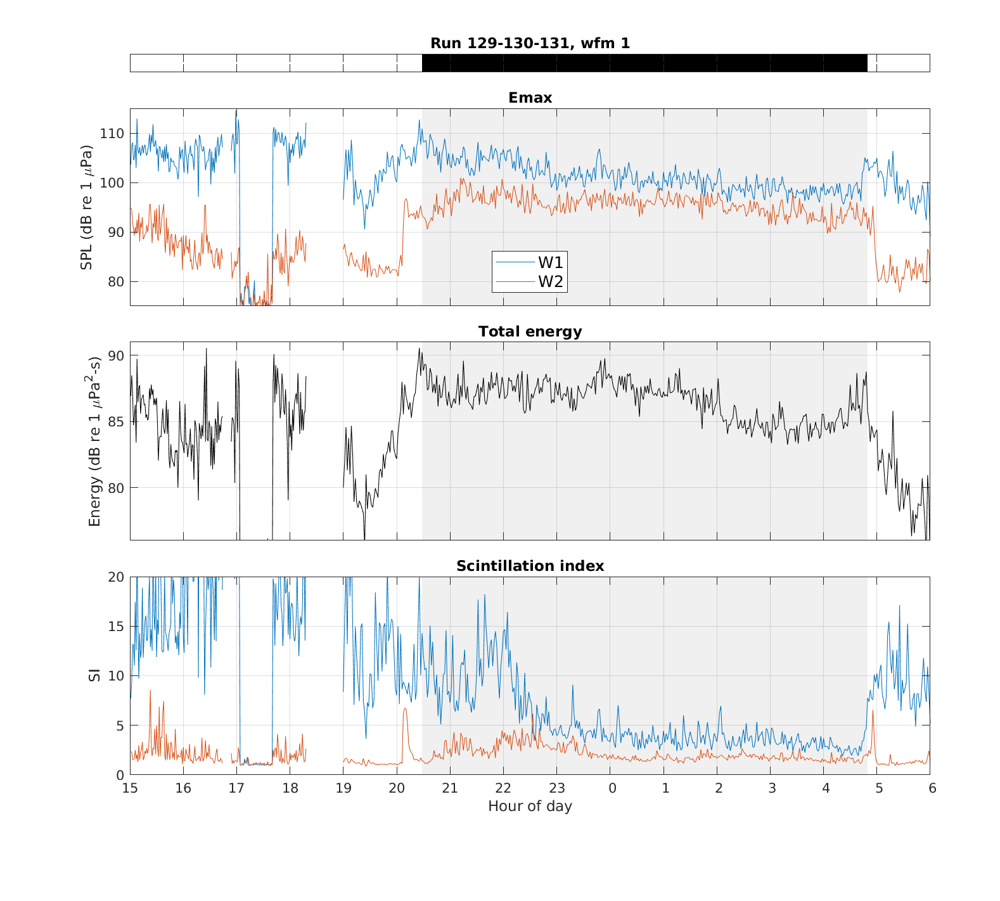
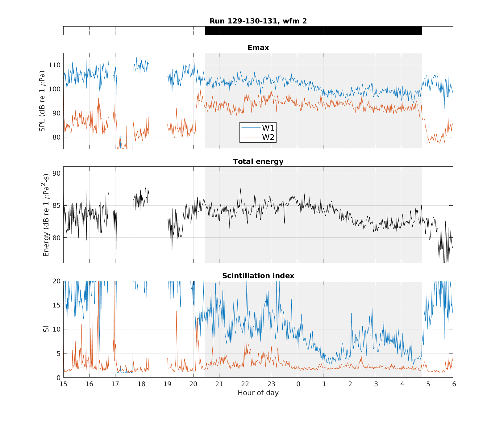

# TREX 13 fish echo analysis @APL
# Notes 2018

************************************************
## 2018/01/13
### Set up emacs+git environment
- Use [Magit](https://magit.vc/) to integrate emacs workflow with git. The latest Magit code from the repo couldn't compile `magit-status.el`, so downloaded 2 releases back (now using v.2.10.3). When compiling v.2.11 and v.2.10.3, ran into problem with compiling `magit-version.el`, but it turned out to be not having installed `makeinfo`. Everything went fine after `sudo apt-get install texinfo` which contains `makeinfo` the code compiles without problem
- Quick hotkeys for Magit:
	- `C-x g` to bring Magit main menu, `s` to stage, `u` to unstage
	- `c` to bring up commit menu, `c` again to confirm commit and will bring up text file for commit message, `C-c C-c` when in the message editor to actually commit.
	- `P` to bring up push menu, and `u` to push to upstream
	- `y` to bring up branch menu

### Picked up from Sept 2017 re. TREX fish ms
- Change AW2 so that the sizes of AW1=AW2. As a result have to run all summary figures again and remake figures.
	- revised `echo_info.m`, `echo_info_fcn.m`, added `echo_info_runner.m`
	- rename all results from 2017 (with unequal sizes of AW1 and AW2) to be of the format `unequalAW12_*`
- New AW2 range and angle extend:
	```
	no_rr = [3.71999,3.92];  % modified 2018/01/13 (make sizes of AW2=AW1)
	no_aa = [-2.45,-2.26];
	```
	before it was
	```
	no_rr = [3.60,3.92];
	no_aa = [-2.45,-2.27];
	```

************************************************
## 2018/01/14
### Continue on updating all AW2 results
- Revised `summarize_run_fcn.m` and `summarize_run_fcn_runner.m`
	- results saved in `summarize_run` (2017 results in `unequalAW12_summarize_run`)
	- figures used in Fig. 3-4 of ms v7.0
- Revised `compare_run.m`
	- results saves in `compare_run` (2017 results in `unequalAW12_compare_run`)
	- figures used in Fig. 5 of ms v7.0
- Revised `fig_stat_echogram`
	- results saved in `fig_stat_echogram_run` (2017 results in `unequalAW12_fig_stat_echogram_run*`)
	- figures used in Fig. 3 of ms v7.0
- Note: `fig_selected_pings_echogram` is for plotting echograms only with windows, and was used to plot the panels in Fig. 2C of ms v5.0 (these panels are moved to form an independent Fig. 2 in ms v7.0)


************************************************
## 2018/01/19-21
### Quantitative estimation of fish speed
- Felt the best way to present fish speed is to present how the fish echoes spread along a particular direction from the center of the wreck (i.e., a radial line extending from the wreck center).
- This should probably be done over multiple directions (multiple radial lines) to show the variability, which may also make the estimation more convincing.
- Use the following 4 code for fish speed estimation
	- `fish_speed.m`:
		- Call`get_xyloc_along_line.m` find the set of x-y locations (`xy_loc`) that are nearest to the wanted locations (`dl.xy_vec`) and calculate the projected range from wreck (`r_proj`) along the specified direction (`dl.a`)
		- Call `get_echo_level_along_line.m` to use 1D interpolation to interpolate for fish echo level at the wanted range/locations (`echo_level`).
	- Note that to get `dl.xy_vec` there is a parameter to tune how fine the wanted locations are spaced (`dl.r_diff_div`). This parameter is explored by using `dl.r_diff_div = 1, 2, 4`.
	- `fish_speed_line_check.m`: compare the wanted and nearest x-y locations and projected range along a certain direction when suing different `dl.r_diff_div` values.


************************************************
## 2018/03/07
### Re-calculate total echo energy
- Realized that the current total echo energy was not correctly calculated: the cross-angle delta length is not taken into account during integration.
- The total echo energy figure (in version `figs_20180115`) is produced by `fig_energy_si_sun.m` in which the compensation for delta length in integration and calibration factors are done right before plotting. However the cross-angle delta length cannot be compensated once the values within AW3 are added (in this line `energy_in_bnd = sum(A.data.beam_mf_in_time(idx_in_bnd).^2);`). This has to be corrected.
- In the corrected version (`figs_20180307`) the integration factors are done in `echo_info_fcn` so that the cross-angle delta length can be factored in properly. Both `echo_info_fcn.m` and `fig_energy_si_sun.m` needs to be changed.
- Spent some time to figure out units...
  - Pa = kg.m^-1.s^-2
  - 1 Pa = 1 N/m^2 = 1 kg/(m.s^2) = 1 J/m^3
  - (power) Watt = kg.s^-3.m^2
  - (energy) Joule = Watt.s = kg.s^-2.m^2
  - Here we have: Pa^2.m.s = Watt.m^-3 ==> unit of power density? the unit is equivalent to Watt/mass density
- Consolidate folders with old results
  - Moved all `echo_info_run*` folders from Jan 2018 to under folder `echo_info_201801`
  - Moved all `unequalAW12_echo_info_run*` folders from 2017 to under folder `echo_info_201702_unequalAW12`
- Sequence of code to be run to make new total echo energy plot:
  1. `echo_info_fcn_runner`
  2. `summarize_run_fcn_runner`
  3. `compare_run` --> there is a one panel of total echo energy in this compariso across multiple days
  4. `fig_energy_si_sum` --> the total echo energy figure in the paper is extracted from a panel in this figure
- The variation of total echo energy remains almost identical
- Note the total echo energy plotted in `compare_run` are the incorrect ones (without proper delta along range and across angle), but it's virtually identical.


************************************************
## 2018/03/08
### Revising split-window normalizer output figure
- Need to find good examples that correspond with the theme in the text.
- Decided to use the following pings: 23, 49, 103, 509. 781
  - ping 23 and 49 will show the fluctuating fish clutter to the southwest of the shipwreck
  - ping 49 to 103 will show similar normalizer output but very different echo pdf (when compared with Fig.3)
  - ping 509 will show shipwreck echo partially smeared by fish echoes, and fish scattering elevates the reverberation level
  - ping 781 will show a near-dawn snapshot and also the fish echo clutter as in ping 23 and 49
- The new Fig.7 use sm_len=150 to make the shipwreck normalizer output more visible


************************************************
## 2018/03/09,13,29
### Make new videos showing the emergence and convergence of fish
- Make sure to plot axes as X and Y instead of Distance as before
- The final movies were assembled in Premiere using individual frames plotted using `fig_echogram_for_movie.m`


************************************************
## 2018/04/01-02
### Investigate beamwidths from different waveforms
- I modified an old code `beamwidth_cmp_MF_noMF` to investigate this
- The new code renamed `beamwidth_cmp_nb_bb` in which I compare the beamwidths resulted from narrowband signals from 1.8:0.1:3.6 kHz with those from broadband signals (1.8-2.7 kHz and 2.7-3.6 kHz). These are the frequencies used in run 131.
- In the paper all figures are from echograms from the 1.8-2.7 kHz waveform.
- I suspect the 2.2 deg figure is from 3.6 kHz.
- The results are intuitive: both broadband signals produce wider beamwidth than the 3.6 kHz signal, and the 2.7-3.6 kHz signal produces narrower beam than the 1.8-2.7 kHz signal.
  
  
- These results are confirmed visuallly by inspecting the echograms from run 087 (narrowband) and run 131 (broadband with the above 2 waveforms).
- All comparison figures are saved in the folder `beamwidth_cmp_nb_bb`.
- Check the accumulated beam energy with increasing angle to confirm that counting only up to -3 dB full beamwidth point is sufficient to incorporate most of the energy:
  
  


### Re-do the total echo energy figure again
- DJ and I spent some time sorting out the units for the figure
- Basically it boils down to the fact that angle is dimensionless, and therefore the integration results should still with the untis **1uPa^2-sec**. What I did earlier to integrate over distance in the cross-beam direction doesn't make sense.
- The beam resolution issue can be solved by normalizing the number of beamformed directions (the resolution) by the actual beamwidth (i.e., how many directions are beamformed within 2.2 degree).
- functions updated:
  - `echo_info_fcn`
  - `echo_info_fcn_runner`
  - `fig_energy_si_sun`
- updated figure file in ms, old fig_energy_si_sun files from March 2018 were saved under `fig_energy_si_sun_201803` in `/trex_fish/figs_results` folder and under ms fig folder `matlab_figs_20180401`.


************************************************
## 2018/05/14-15
### Process run 129 and 130
- Need to process these two runs to figure out why there was high Emax and SI in AW1 before dusk. Was this a pattern from earlier during the day?
- May have to process data from other days before the overnight session to figure this out.
- Run 129 and 130 used the same 2 waveforms as run 131, which is the expt session we focus analysis on for the ms.
  - Run 130: 170 pings
  - Run 129: 210 pings
- Added `subset_beamform_runner` and updated `get_SL`, `echo_info_fcn`, `echo_info_fcn_runner` for processing these 2 runs.
- Run 130 was stopped and restarted so there were some confusion of file numbers. Jie noted that there were 96 good files in run 130. This number is consistent with the number of files in the run 131 HAARI folder. But I decided to only use the last 76 files (ping 95-170) since I can be certain that these are the files that did not have problem after the system was restarted.
- LF waveform


- HF waveform



************************************************
## 2018/08/01
### Checking fish resonance for responding reviewer's comments
- Refs:
	- Stanton et al. 2012 points to Diachok 2005 review for the differences between physoclits and physostomes, as well as Nero et al. 2004 paper for the V=AL^3.35 formulation between swimbladder volume (V) and fish length (L).


************************************************
## 2018/08/14
### Finalize revision and submit
- `trex_fish_ms_v11.0_revision` has all track changes.
- `trex_fish_ms_v11.1_revision`
	- all changes accepted
	- Stanton et al. submitted --> Stanton et al. 2018
	- removed all doi from reference list
	- updated Jie's paper with issue and page info (before was "early online")
- Note there is an additional line in Fig. 2 caption compared to the submitted version.
- The reviewer pdf is prepared using `trex_fish_ms_v11.1_revision`.
